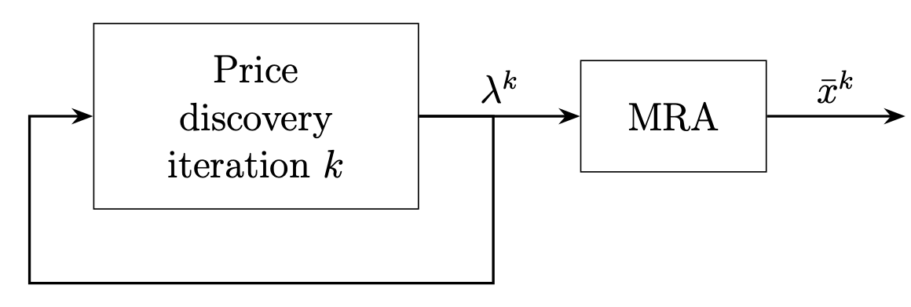

Multiple-response agents: Fast, feasible, approximate primal recovery 
for dual optimization methods
=========================================

This repository accompanies the paper ["Multiple-Response Agents: Fast, Feasible, Approximate Primal Recovery for Dual Optimization Methods"](XXX).

The `mra` package implements multiple-response agents (MRA) method for primal variable
recovery in dual optimization methods. 
We consider the following problem
$$
\begin{array}{ll}
\text{minimize} & \sum_{i=1}^K f_i(x_i)\\ 
\text{subject to} & \sum_{i=1}^K A_i x_i \leq b,
\end{array}
$$
where $f_i:\mathbf{R}^{n_i} \to \mathbf{R} \cup \{\infty\}$, 
$A_i:\mathbf{R}^{m \times n_i}$ and $b:\mathbf{R}^{m}$ are given, for all $i=1, \ldots, K$.
We refer to $f_i$ as agent $i$.
We assume each agent implements *conjugate subgradient oracle*
$$
x_i(y_i) \in \argmin_{z_i \in \mathbf{dom} f_i} \left( f_i(z_i) - y_i^Tz_i \right),
\quad i=1,\ldots, K,
$$
and *approximate conjugate subgradient oracle* that returns $x^{\text{apx}}(y)$ that approximately
minimizes 
$f(z) - y^{T} z$ with respect to $z$, i.e., 
$$
    -f^*(y)  \leq f(x^{\text{apx}}(y)) - y^{T} x^{\text{apx}}(y) 
    \approx -f^*(y).
$$

Then MRA constructs a new primal point $\bar x^k$ based on current estimation of dual variables
$\lambda^k$ that reduces the primal residuals. The figure below illustrates the overall optimization
flow of MRA.




`MRA_Primal_Recovery`:
- Key parameters:
    - `fun_agents`: List of agent functions that return responses for a given dual vector.
    - `primal_var_size`: Total dimension of the primal variable.
    - `A_ineq`, `b_ineq`, `A_eq`, `b_eq`: constraint matrices and vectors.
    - `history`: Number of past iterations to retain.
- Methods:
    - `query`:
        - Inputs:
        - `lamb_k`: Current dual price vector.
        - `K`: Number of responses per agent: first response from the conjugate subgradient oracle, and `K-1` responses from the approximate conjugate subgradient oracle.
        - `epoch`: Iteration index (updates history).
        - Outputs:
        - `x_k`: Primal solution vector.
        - `Zs`: List of candidate response matrices.
    - `primal_recovery`:
        - Process:
        1. Determine weights (`u_best`) via convex relaxation (default) or MILP/greedy.
        2. Combine responses: For each agent, compute `Zs[i]` @ `u_best[i]`.

Usage:
---------
```python
import mra
fun_agents, primal_var_size, A_ineq, b_ineq = ...
MRA = mra.MRA_Primal_Recovery(fun_agents, primal_var_size,
                                A_ineq=A_ineq, b_ineq=b_ineq)
x_k, Zs = MRA.query(lamb_k, K=10, epoch=0)
bar_xk = MRA.primal_recovery(lamb_k, Zs)
```

